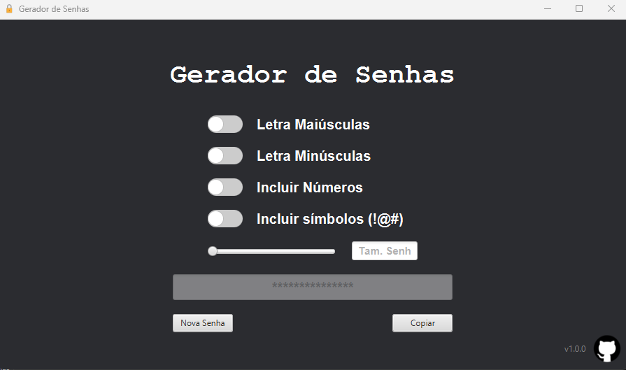

# Gerador de Senhas com Interface Gráfica

**Descrição do Projeto:**  
Aplicativo em Java com interface gráfica para geração de senhas seguras.

Este projeto implementa um gerador de senhas aleatórias com uma interface gráfica construída com JavaFX. A geração das senhas é feita utilizando a classe `SecureRandom` para garantir segurança e aleatoriedade. O projeto permite que o usuário escolha o comprimento da senha e obtenha um resultado instantâneo via interface.

---

## 🧩 Funcionalidades

- Geração de senhas aleatórias com letras, números e caracteres especiais.
- Interface gráfica amigável construída com JavaFX.
- Uso da classe `SecureRandom` para maior segurança.
- Opção de personalizar o comprimento da senha.

---

## 🛠️ Implementação Detalhada

- O arquivo `GeradorSenhas.java` contém a lógica principal da geração de senhas.
- O arquivo `App.java` inicia a aplicação JavaFX.
- O arquivo `Application.java` contém configuração adicional da aplicação.
- O layout da interface está definido no arquivo FXML `GeradorSenhas.fxml`.

---

## 🖼️ Exemplo de Interação

Abaixo, uma captura de tela da interface do gerador de senhas em execução:

> O usuário define o comprimento da senha e clica no botão **Gerar Senha**. A senha aleatória aparece instantaneamente no campo correspondente, contendo uma mistura de letras, números e símbolos.

---
